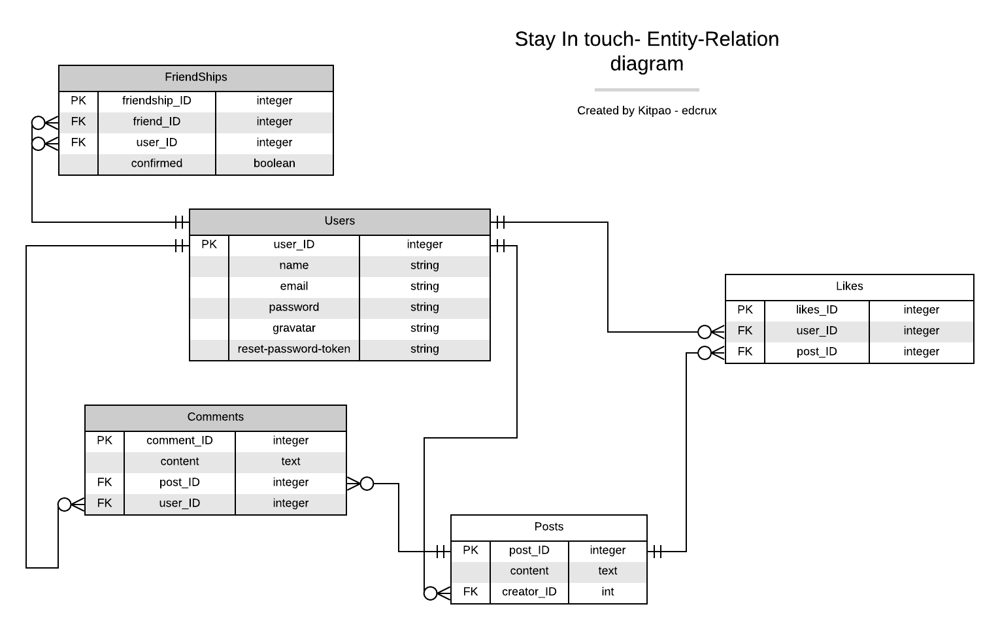

[![Contributors][contributors-shield]][contributors-url]
[![Forks][forks-shield]][forks-url]
[![Stargazers][stars-shield]][stars-url]
[![Issues][issues-shield]][issues-url]
[![LinkedIn][linkedin-shield]][linkedin-url]
[![LinkedIn][linkedin-shield2]][linkedin-url2]

<!-- PROJECT LOGO -->
 

  <h2 align="center"> Social media app: Stay In Touch</h2>
  

     This is the repo for the webapp Stay In Touch in [stay-in-touch-by-kit-ed.herokuapp.com/](stay-in-touch-by-kit-ed.herokuapp.com/). This is a social media app where an authenticated user can interact with others, send friendship invitations and see only the posts of their friends. We made use of our diverse knowledge of rails in ActiveRecord, ActionController and RSpec for testing.
     
    <a href="https://github.com/kitpao/private-events"><strong>Explore the docs »</strong></a>
     
     
    <a href="https://github.com/kitpao/private-events">View Demo</a>
    ·
    <a href="https://github.com/kitpao/private-events/issues">Report Bug</a>
    ·
    <a href="https://github.com/kitpao/private-events/issues">Request Feature</a>
  

## Table of Contents
* [About the Project](#about-the-project)
  * [Built With](#built-with)
* [Instalation guide](#instalation-guide)
* [Test](#test)
* [Roadmap](#roadmap)
* [Contact](#contact)
* [Contributing](#contributing)
* [Show your support](#show-your-support)
* [Acknowledgements](#acknowledgements)
* [License](#license)
<!-- ABOUT THE PROJECT -->

## About The Project
<em>Click on the image to visit the live version! available at [stay-in-touch-by-kit-ed.herokuapp.com/](stay-in-touch-by-kit-ed.herokuapp.com/)</em>
[![Product Name Screen Shot][product-screenshot]](stay-in-touch-by-kit-ed.herokuapp.com/)

The Entity Relation Diagram for this project was the following,

In this project we planned all the associations needed for the funtionality and ensured the following features: 
   * As a guest user:
    - Able to create account/log in.
    - Only see “Sign in” and “Sign out” page.

   * As a logged-in user:
    - Access all users list.
    - Access selected user page with their user name and all posts written by them (the most recent posts on the top).
    - Send a friendship invitation.
    - Access button “Invite to friendship” next to the name of user who is not my friend yet - on both users’ list and single user page.
    - Access pending friendship invitations sent to me from other users.
    - Accept or reject friendships invitation.
    - Create new posts (text only).
    - Like/dislike posts (but I can like single post only once).
    - Add comments to posts.
    - Access “Timeline” page with posts (with number of likes and comments) written by me and all my friends (the most recent posts on the top).
    - Timeline page should be the root page of the app.

### Built With
The project was developed using the following technologies:
- [RUBY v2.7.0](https://www.ruby-lang.org/es/)
- [RUBOCOP LINTERN](https://github.com/microverseinc/linters-config/tree/master/ruby)
- [RUBY ON RAILS v5.2.4](https://rubyonrails.org/)
- [DEVISE gem](https://github.com/heartcombo/devise)
- [RSPEC gem](https://github.com/rspec/rspec-rails)
- [POSTGRES >=v10.12](www.postgresql.org)

## Instalation Guide
Click on the following [link](https://gitpod.io/github.com/EdCrux/ror-social-scaffold),

* Wait for the workspace to load and then click on the terminal, type `brew install postgresql` and hit enter to install postgres for database
* After it finishes, copy and paste the last line you get from your terminal, it should be something like `pg_ctl -D /home/linuxbrew/.linuxbrew/var/postgres start` and hit enter to start the postgres server
* After its done, type `bundle install` to install all required gems
* Go to "Open Ports" tab near the terminal and make both servers public
* Go to config/database.yml and double click to edit
* Go to line 22 and 23 and uncomment them
* Then `yarn install --check-files` and hit enter
* Run `rails db:migrate` and hit enter
* Run `rails c` and hit enter to interact with the objects in the console (User, Event, Invitation: see the schema for more information)

-> or see the direct page working on https://floating-chamber-00036.herokuapp.com/ and you can test it directly in the browser!!

## Test

For the test, click on the following [link](https://gitpod.io/github.com/kitpao/my_enumerable_methods),

* Click on the console and type `gem install rspec` then press enter to begin the instalation process
* Once the process is done, type `rspec` and press enter to see the 67 test for this game
* You can see the test files by clicking on the left panel spec/my_methods_spec.rb

## Roadmap

See the [open issues](https://github.com/kitpao/private-events/issues) for a list of proposed features (and known issues).

## Contact

  Project Link: [https://github.com/kitpao/private-events](https://github.com/kitpao/private-events)

  Kitzia Paola Vidal Marroquin - [Github user: kitpao](https://github.com/kitpao)

    <a target="_blank" href="https://mail.google.com/mail/?view=cm&fs=1&tf=1&to=kitpao91@gmail.com">
      kitpao91@gmail.com
    </a> &nbsp; |
    <a target="_blank" href="https://github.com/kitpao/Personal_Projects">
        Portfolio
    </a> &nbsp; |
    <a target="_blank" href="https://www.linkedin.com/in/kitzia-paola-vidal/">
      LinkedIn
    </a> &nbsp; |
    <a target="_blank" href="https://twitter.com/Kitpao1">
      Twitter
    </a>

  Jesus Eduardo Cruz Valdez - [EdCrux](https://github.com/EdCrux
)

    <a target="_blank" href="https://mail.google.com/mail/?view=cm&fs=1&tf=1&to=jecruxiz@gmail.com
">
      jecruxiz@gmail.com
    </a> &nbsp; |
    <a target="_blank" href="https://github.com/EdCrux?tab=repositories">
        My Repositories
    </a> &nbsp; |
    <a target="_blank" href="www.linkedin.com/in/edcrux">
      LinkedIn
    </a> &nbsp; |
    <a target="_blank" href="https://twitter.com/edcrux8">
      Twitter
    </a>

## Contributing 

🤝 Contributions, issues and feature requests are welcome!

Feel free to check the [issues page](issues/).

## Show your support

Give a ⭐️ if you like this project!

## Acknowledgements
- [Microverse curriculum Rails section](https://www.microverse.org/?grsf=6ns691)
- [The Odin project: Associations](https://www.theodinproject.com/courses/ruby-on-rails/lessons/associations)
- [Rails Guides](https://guides.rubyonrails.org)

## License

📝 MIT License

<!-- MARKDOWN LINKS & IMAGES -->
[contributors-shield]: https://img.shields.io/github/contributors/kitpao/private-events.svg?style=flat-square
[contributors-url]: https://github.com/kitpao/private-events/graphs/contributors
[forks-shield]: https://img.shields.io/github/forks/kitpao/private-events.svg?style=flat-square
[forks-url]: https://github.com/kitpao/private-events/network/members
[stars-shield]: https://img.shields.io/github/stars/kitpao/private-events.svg?style=flat-square
[stars-url]: https://github.com/kitpao/private-events/stargazers
[issues-shield]: https://img.shields.io/github/issues/kitpao/private-events.svg?style=flat-square
[issues-url]: https://github.com/kitpao/private-events/issues
[license-shield]: https://img.shields.io/github/license/kitpao/private-events.svg?style=flat-square
[license-url]: https://github.com/kitpao/private-events/blob/master/LICENSE.txt
[linkedin-shield]: https://img.shields.io/badge/-LinkedIn-black.svg?style=flat-square&logo=linkedin&colorB=555
[linkedin-url]: https://www.linkedin.com/in/kitzia-paola-vidal/
[linkedin-shield2]: https://img.shields.io/badge/-LinkedIn-black.svg?style=flat-square&logo=linkedin&colorB=555
[linkedin-url2]: https://www.linkedin.com/in/edcrux/
[product-screenshot]: app/assets/images/desktop.png
[mobile]: app/assets/images/phone.png
